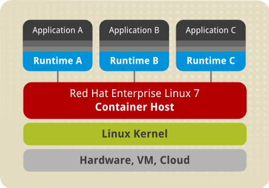
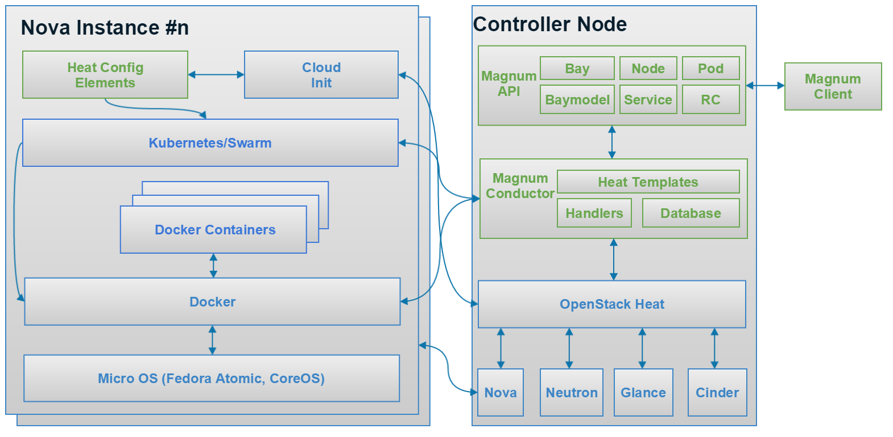

I. Kiến thức cần có trước khi làm việc với Magnum
* K8S
* Docker
## K8S
1. Cluster
K8S Cluster là một tập cái nodes(master nodes, worker node) để chạy các ứng dụng. Mỗi Cluster đều chứa đựng một control plane,
một hoặc nhiều nodes. Trong đó Control Plane chịu trách nhiệm duy trì các trạng thái của cluster ví dụ: ứng dụng nào đang được 
chạy hay container images nào đang được sử dụng. Còn các nodes(master nodes, worker node) thì đảm nhiệm việc chạy các ứng dụng
và tải(workload)

2. Node
## Docker
Container là môi trường để K8S chạy các ứng dụng. Nó bao gồm có container image, source code, application, system libraries, 
và các cài đặt mạc định cần thiết. Container là immutable nghĩa là không thể thay đổi bất kỳ thứ gì như source code khi nó 
đang running.
Container runtime là một software chịu trách nhiệm running các containers.
K8S hỗ trợ mợ vài loại container runtime: Docker, Containerd, CRI-O và bất kỳ software nào phát triển dưa trên 
[CRI](https://github.com/kubernetes/community/blob/master/contributors/devel/sig-node/container-runtime-interface.md) 

Docker là một nền tảng mã nguồn mở được sử dụng để triển khai các ứng dụng một cách nhanh chóng. 
Mỗi docker container thì đều sử dụng chung các tài nguyên kernel của host như: system libraries, drivers, hardware, 
Files system.
Một số khải niệm sử dụng trong K8S Mugnum:
* docker_volume_size: là size của node disk.
* docker_storage_driver: 
 II. Magnum
 1. Overview
 
