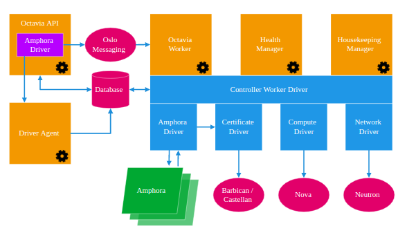
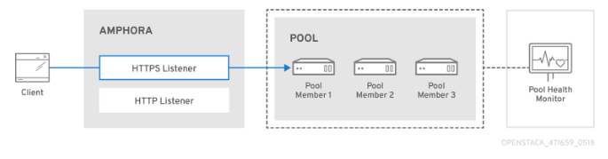

# *Octavia Part1*
## I. Overview
*Octavia* là một open source, một giải pháp cân bằng tải (load balancing) được thiết kế để làm việc với *Openstack*. 
*Octavia* là phiên bản nâng cấp hoàn hảo(V2) của Neutron LBaaS (V1).
   
   
Octavia v4.0 bao gồm các thành phần chính sau:
1. **Amphorae**
*Amphora* à một instance trong compute nodes và thực hiện chức năng cân bằng tải
Client sẽ gửi các request tới Amphora 
2. **Controller**  
*Controller* là bộ não của Octavia. Nó bao gồm có 5 thành phần chính:
 
2.1 

* **API Controller**: 
3. Network
## II. 
## III. Usage
## IV. Coding
### 1. Console
### 2. Orchestrator

