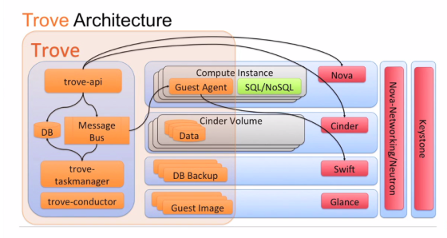
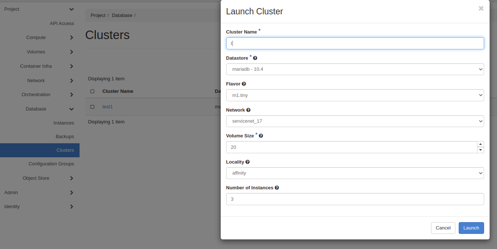
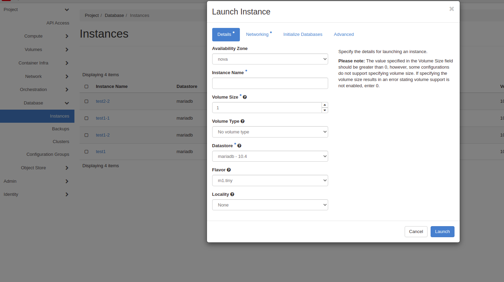
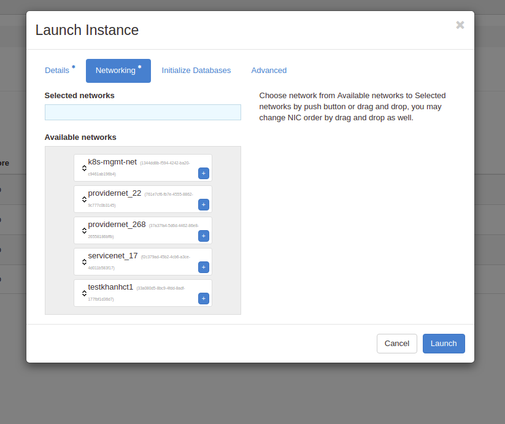
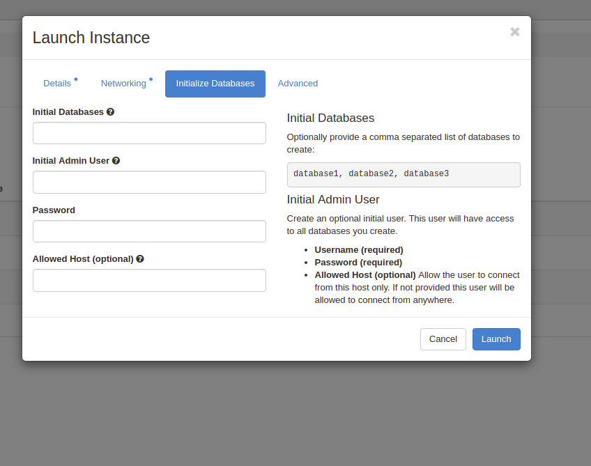
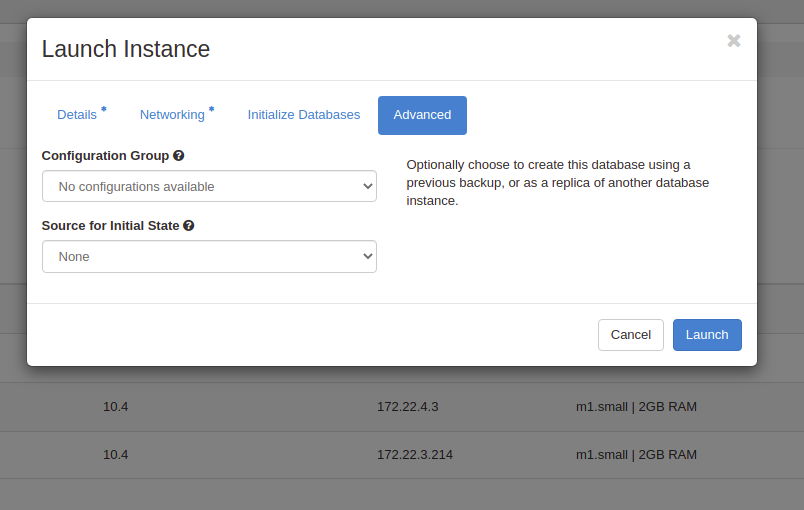

## 1. Trove Architecture 
 <br/>
Trove bao gồm các thành phần sau:
* API Server
* Message Bus
* Task Manager
* Guest Agent
* Conductor
1. API Server
Trove API cung cấp các interface để giao tiếp giữa user với các sub-systems trong hệ thống. Về cơ bản, trove API giao tiếp 
với hai services chính.
- Task Manager thông qua Message Bus. Nó sẽ nói chuyện với TM(Task manager) để thực hiện các thao tác phức tạp như: provisioning
instances hoặc đồng bộ dữ liệu giữa các replicas hay các instances trong cluster.
- Nó có thể nói chuyện trực tiếp với Guest Agent(GA) để thực hiên các thao tác như: get database users or name. 
- Nó có thể gọi các openstack services khác như keystone để chứng thực users, hay cinder, nova
Trove API service là stateless.
2. Message Bus(MB)
MB là một queue brokers giữ các API endpoints, TM and GA. 
Về cơ bản khi một request được gửi tới API server thì sẽ được chứng thực để đảm bảo rằng user có quyền được thực hiện các 
lệnh sau đó. Sau khi request được chứng thực thì nó sẽ được passing tới các topics trên MB và trigger ra các events. Các 
wokers liên quan sẽ lắng nghe trên các topics và sẽ nhận các tasks sau khi events được trigger. Sau khi thực hiện xong 
các tasks thì response sẽ được gửi tới queues tương ứng và API server sẽ lấy những response này đẻ trả lại cho users.
3. Task Manager
Task manager là key service trong kiến trúc Trove. Nó đảm nhiệm việc thực hiện các tasks phức tạp tốn nhiều efforts
như provisioning các instances, quản lý vòng đời của instances và thực hiện các thao tác trên instances.
- Lắng nghe và xử lý các envents trên Message bus(Rabbit MQ)
- Nhận và xử lý 
Trove API service là statefull.
4. Guest Agent(GA)
GA là một agent được cài vào trong các instances để quản lý và thực hiện các thao tác trên dabastore.
- GA chịu trách nhiệm run các services cần thiết trong datastore để đảm báo nó online và có thể thực hiện tasks phức tạp
Mỗi một loại datastore sẽ có một loại agent tương ứng. 
GA là một statefull
5. Conductor
Khác với GA chạy trên các instances. Conductor là một service chạy trên trove hosts để nhận các message từ GA để cập nhật
thông tin tới trove database ví dụ như status của instances, backups.
Conductor cũng lắng nghe các messages trên MB và thực hiện các tasks liên quan 

## 2. Database cluster
Database cluster là một nhóm các servers hoặc instances cùng manage một single database. Mỗi server hoặc instance có thẻ có
một phần hoặc đầy đủ các permissions để manage số lượng data hoặc request tới single database. Dữ liệu trong servers/instances
được synchronize với nhau. Có hai mô hình quản lý chính trong một cluster:
1. Active-Active: là mô hình mà tất cả các servers/instances trong cluster đều được promote làm master. Nghĩa là, nếu một 
server dừng thì connection vẫn được giữ vì các server khác vẫn còn các servers khác active. Tất cả các node để được 
full quyền read và write <br/>
### Pros
    * Không có thời gian downtime khi master bị chết.
    * Thời gian select data nhỏ vì có thể select trên bất kỳ node nào
### Cons
    * Thời gian insert dữ liệu lớn vì dữ liệu phải được đồng bộ trên tất cả các node. Nếu một node mà đồng bộ dữ liệu sai thì
    có thể gây ra lỗi cho toàn bộ cluser.
2. Active-massive: là mô hình mà một trong các servers/instances trong cluster được promote làm master các servers/instances
còn lại là worker và được đánh trọng số *weight* là trọng số mà khi master chết thì servers/instances có weight cao sẽ được 
promote lên làm master.
Master node sẽ được đầy đủ quyền read write trong khi đó worker node chỉ có quyền read. 
### Pros
    * Thời gian insert dữ liệu nhỏ vì dữ liệu chỉ cần được write trên master node. Việc đồng bộ dữ liệu giữa master và worker nodes 
    sẽ được chạy ngầm.
    * Thời gian select data nhỏ vì có thể select trên bất kỳ workers nào
### Cons
    * Có thời gian downtime khi master bị chết. Vì cần thời gian để promote một worker node lên làm master.

Có một vài lợi thế chính khi chúng ta setup một cụm cluster
1. Data Redundancy(Dư thừa dữ liệu)
Dữ liệu được lưu trên tất các các nodes trong cluster điều này dẫn đến việc dư thừa dữ liệu trong cluster. Mỗi node sẽ đồng
bộ dữ liệu từ master node nghĩa là chúng sẽ lưu cùng một loại dữ liệu giống nhau. Điều này gây ra một điều khác bất lợi khi 
một trong các nodes gặp sự cố(có thể bị đánh cắp dữ liệu)

2. Load balancing(Cân bằng tải)
Cấn bằng tải là một feature mà hầu hết các hệ thống database hiện này đều có. Một machine đơn lẻ có thể bị quá tải vì phải 
xử lý quá nhiều request cùng một lúc.
Trong cluster các request sẽ được chia đều trên mỗi nodes để thực thi. Nếu một node bị chết thì request sẽ được xử lý bởi 
một node khác.
Một vài thuật toán được sử dụng trong cân bằng tải: round robbin, least connections, ...  
3. Hight Availability
4. Monitoring and Automotion
## 3. Trove Cluster
Trove cluster kế thừa được đầy đủ các tính năng của một database cluster. Nó sử dụng mô hình ***active-active*** để quản lý 
các nodes.
#### Tạo trove cluster trên horizon

#### Tạo trove cluster bằng command line 
Please refer [command](https://docs.openstack.org/python-troveclient/pike/cli/trove.html#trove-cluster-create)
#### Tạo trove cluster bằng python3.8
```shell script
import os
import uuid

from keystoneauth1 import loading
from keystoneauth1 import session

from troveclient import client


def get_credentials(os_info):
    """
    Returns a creds dictionary filled with parsed from env
    Keystone API version used is 3;
    environment variable 'OS_TENANT_NAME' is replaced by
    'OS_PROJECT_NAME'.
    """
    credentials = os_info['auth']

    if not credentials:

        credentials = {
            'username': os.environ.get('OS_USERNAME'),
            'password': os.environ.get('OS_PASSWORD'),
            'auth_url': os.environ.get('OS_AUTH_URL'),
            'project_name': os.environ.get('OS_PROJECT_NAME'),
        }
        if os.getenv('OS_USER_DOMAIN_NAME'):
            credentials['user_domain_name'] = os.getenv('OS_USER_DOMAIN_NAME')

        if os.getenv('OS_PROJECT_DOMAIN_NAME'):
            credentials['project_domain_name'] = os.getenv('OS_PROJECT_DOMAIN_NAME')

    return credentials


def get_session_auth(os_info):
    """
    Get authentication session
    :return:
    """
    loader = loading.get_plugin_loader('password')
    creds = get_credentials(os_info)
    auth = loader.load_from_options(**creds)
    return auth


def get_session(os_info):
    """
    Get s new session
    :return:
    """
    auth = get_session_auth(os_info)
    try:
        cacert = os.environ['OS_CACERT']
    except KeyError:
        return session.Session(auth=auth)
    else:
        insecure = os.getenv('OS_INSECURE', '').lower() == 'true'
        cacert = False if insecure else cacert
        return session.Session(auth=auth, verify=cacert)


def create_cluster(name, datastore_id, datastore_version_id, flavor_id, volume_size,
                   volume_type=None, number_of_instances=3, network_id=None, locality=None,
                   availability_zone=None, extended_properties=None, configuration=None):
    os_cloud_config = {
        'verify': False,
        'region_name': 'regionOne',
        'auth': {
            'username': 'tester',
            'password': 'tester',
            'project_name': 'tester',
            'auth_url': 'https://example.com:13000/v3',
            'project_domain_name': 'Default',
            'user_domain_name': 'Default',
        }
    }

    sess = get_session(os_cloud_config)
    trove_client = client.Client(version='1', session=sess)
    instances = []
    for i in range(0, number_of_instances):
        instance = {
            'name':  '{}-member-{}'.format(name, 'member', str(i + 1)),
            'flavorRef': flavor_id,
            'volume': {
                'size': volume_size,
            },
            'net-id': network_id,
        }
        if volume_type:
            instance['volume']['type'] = volume_type
        if availability_zone:
            instance['availability_zone'] = availability_zone
        instances.append(instance)

    trove_client.clusters.create(name, datastore_id, datastore_version_id, instances,
                                 locality, extended_properties, configuration)


create_cluster(name='test1', datastore_id='16e745f6-f5d3-4876-9207-2486352d537f',
               datastore_version_id='4d9cb75f-fe87-4152-bf04-3f4e72f22bc7',
               flavor_id='ba45e5dc-3f7f-4de1-863c-109c09e6415d', volume_size=10,
               volume_type=None, number_of_instances=3, network_id='761e7cf6-fb7e-4555-8862-9c777c0b3145',
               locality=None, availability_zone=None, extended_properties=None, configuration=None)
```
## 3. Trove instance
### Tạo trove cluster trên horizon
* Step1 <br/>


* Step2 <br/>


* Step3 <br/>


* Step4 <br/>



### Tạo trove instance bằng command line 
Please refer [command](https://docs.openstack.org/python-troveclient/pike/cli/trove.html#trove-cluster-create)
### Tạo trove cluster bằng python3.8
```shell script
import os
import uuid

from keystoneauth1 import loading
from keystoneauth1 import session

from troveclient import client


def get_credentials(os_info):
    """
    Returns a creds dictionary filled with parsed from env
    Keystone API version used is 3;
    environment variable 'OS_TENANT_NAME' is replaced by
    'OS_PROJECT_NAME'.
    """
    credentials = os_info['auth']

    if not credentials:

        credentials = {
            'username': os.environ.get('OS_USERNAME'),
            'password': os.environ.get('OS_PASSWORD'),
            'auth_url': os.environ.get('OS_AUTH_URL'),
            'project_name': os.environ.get('OS_PROJECT_NAME'),
        }
        if os.getenv('OS_USER_DOMAIN_NAME'):
            credentials['user_domain_name'] = os.getenv('OS_USER_DOMAIN_NAME')

        if os.getenv('OS_PROJECT_DOMAIN_NAME'):
            credentials['project_domain_name'] = os.getenv('OS_PROJECT_DOMAIN_NAME')

    return credentials


def get_session_auth(os_info):
    """
    Get authentication session
    :return:
    """
    loader = loading.get_plugin_loader('password')
    creds = get_credentials(os_info)
    auth = loader.load_from_options(**creds)
    return auth


def get_session(os_info):
    """
    Get s new session
    :return:
    """
    auth = get_session_auth(os_info)
    try:
        cacert = os.environ['OS_CACERT']
    except KeyError:
        return session.Session(auth=auth)
    else:
        insecure = os.getenv('OS_INSECURE', '').lower() == 'true'
        cacert = False if insecure else cacert
        return session.Session(auth=auth, verify=cacert)

def test_create_instance():
    os_cloud_config = {
        'verify': False,
        'region_name': 'regionOne',
        'auth': {
            'username': 'tester',
            'password': 'tester',
            'project_name': 'tester',
            'auth_url': 'https://example.com:13000/v3',
            'project_domain_name': 'Default',
            'user_domain_name': 'Default',
        }
    }

    sess = get_session(os_cloud_config)
    trove_client = client.Client(version='1', session=sess)
    databases = [
        {
            "character_set": "utf8",
            "collate": "utf8_general_ci",
            "name": "sampledb0"
        },
        {
            "character_set": "utf8",
            "collate": "utf8_general_ci",
            "name": "sampledb1"
        }
    ]
    users = [
        {
            'name': 'admin',
            'password': 'admin',
            "databases": [
                {
                 'name': 'sampledb1'
                }
            ],
        }
    ]
    volume = {
        'size': 10,
        # 'type': None
    }
    nics = [
        {
         'net-id': '761e7cf6-fb7e-4555-8862-9c777c0b3145'
        }
    ]
    trove_client.instances.create(name='test2', flavor_id='ba45e5dc-3f7f-4de1-863c-109c09e6415d',
                                  volume=volume, databases=databases, users=users, nics=nics,
                                  datastore_version_id='4d9cb75f-fe87-4152-bf04-3f4e72f22bc7',
                                  datastore_id='16e745f6-f5d3-4876-9207-2486352d537f')
```
## References
[1] [Trove Architecture](https://wiki.openstack.org/wiki/TroveArchitecture) <br/>
[2] [Trove Master](https://github.com/openstack/trove)